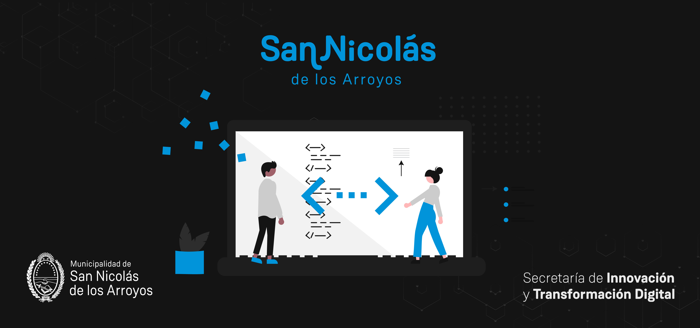

# Desafío técnico 🚀

## Información general

Desde la _Secretaría de Innovación y Transformación Digital_ estamos muy contentos de que estés interesado/a en sumarte a nuestro equipo de desarrollo, pero antes, vamos a proponerte que realices un desafío para que puedas demostrar tus conocimientos en las tecnologías con las cuales trabajamos.

## Requisitos

El desafío consiste en desarrollar una aplicación web que cuente con las vistas detalladas a continuación.

### Registro

Desde esta vista los usuarios podrán crear una cuenta con su informacion personal, como mínimo: nombre, apellido, fecha de nacimiento, dni, email, contraseña y foto de perfil.

### Inicio de sesión

Permitirá a los usuarios autenticarse con email y contraseña.

### Pantalla principal

#### Administradores:

Si el usuario es administrador, verá una lista o tabla con los usuarios registrados, pudiendo modificarlos o desactivarlos. La lista o tabla incluirá paginación para visualizar como máximo 10 usuarios a la vez.

#### Usuarios comunes:

En caso contrario, los usuarios comunes visualizarán un mensaje de bienvenida:

### Perfil

Desde aquí los usuarios podrán visualizar y modificar todos los datos asociados a su cuenta.

## A Tener en Cuenta

En el desafío se mencionó que existen dos tipos de usuarios: administradores y usuarios comunes. Es fundamental que implementes un sistema de roles y permisos que refleje esta distinción. A continuación, se detalla la funcionalidad requerida:

- **Roles de Usuario:** Implementa un sistema de roles que permita clasificar a los usuarios como "administradores" y "usuarios comunes". Cada usuario debe tener asignado un rol específico.

- **Permisos de Acceso:** Define diferentes niveles de permisos para cada rol. Los administradores deben tener acceso a ciertas operaciones y pantallas que los usuarios comunes no pueden visualizar.

- **Restricción de Rutas:** Asegúrate de que las rutas y vistas no accesibles para ciertos roles se restrinjan adecuadamente. Por ejemplo, la pantalla de lista de usuarios y las funciones de modificación solo deben estar disponibles para los administradores.

## Tips para el Desafío 🚀

Para ayudarte en el desarrollo de este desafío técnico, aquí te proporcionamos algunos consejos y recomendaciones:

1. **Diseño Responsive:** Asegúrate de que tu aplicación sea completamente responsive y se adapte correctamente a diferentes tamaños de pantalla, incluyendo dispositivos móviles.

2. **Validación de Datos:** Implementa una validación adecuada de los datos ingresados por los usuarios, tanto en el frontend como en el backend, para garantizar la integridad y seguridad de la información.

3. **Seguridad de Contraseñas:** Utiliza un algoritmo seguro para el hasheo de contraseñas, como bcrypt, y evita almacenar contraseñas en texto plano.

4. **Control de Errores:** Implementa un manejo adecuado de errores en el backend y proporciona mensajes de error claros y amigables para los usuarios en el frontend.

5. **Almacenamiento de Archivos:** Para utilizar un correcto manejo de archivos sugerimos utilizar FTP.

6. **Documentación:** Asegúrate de incluir una documentación clara y detallada tanto en el código como en el README para que otros desarrolladores puedan entender y colaborar en tu proyecto.

Recuerda que el objetivo principal es demostrar tus habilidades y conocimientos en el desarrollo de aplicaciones web.

## Especificaciones técnicas

Para el desarrollo del backend deberás utilizar:

- [Node.js](https://nodejs.org/) con [Express](https://expressjs.com/) como framework.
- Base de datos MySQL.
- Sequelize ORM.
- Hasheo de contraseñas.
- Almacenamiento de archivos (FTP)

Para el desarrollo del frontend deberás utilizar:

- [React]()
- Enrutamiento
- [Tailwind CSS](https://tailwindcss.com/)
- Íconos
- Modales y alertas

## Formato de entrega

Una vez terminado el desafío, deberás enviarnos el link del repositorio para que podamos revisarlo. Cada proyecto deberá incluir su documentación correspondiente.  
Luego de la entrega, el proyecto deberá ser presentado en vivo para mostrar su funcionamiento.
