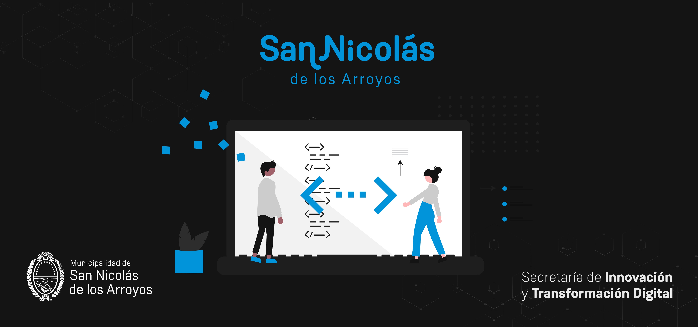

# Desafío técnico 🚀

## Contexto 🌐

Desde la _Secretaría de Innovación y Ciudad Inteligente_ estamos muy contentos de que estés interesado/a en formar parte de nuestro equipo de desarrollo, por lo que vamos a proponerte realizar un desafío técnico para que podamos evaluar tus conocimientos utilizando las tecnologías con las cuales trabajamos a diario.

## Requerimientos 📝

Deberás realizar una aplicación web que permita a los vecinos de nuestra ciudad realizar un trámite de forma online. El trámite a implementar queda a elección del aspirante, pudiendo tomar como referencia el listado disponible en el siguiente [link](https://www.sannicolasciudad.gob.ar/tramites). No es necesario replicar el trámite en su totalidad, pueden omitirse pasos o simplificarse el flujo.

Los vecinos de la ciudad deberán tener la posibilidad de presentar sus trámites y realizar seguimiento a la evolución de los mismos. El formulario que represente al trámite deberá contener al menos 8 campos, uno de ellos (o mas) deberá ser del tipo archivo.

Los administradores del sistema podrán revisar los trámites, cambiar su estado y realizar comentarios.

## Especificaciones técnicas ⚙️

Para el desarrollo del backend deberás utilizar Node, base de datos MySQL y protocolo FTP para el almacenamiento de archivos. Para el frontend deberás utilizar React y Tailwind CSS.

Puedes añadir cualquier otra tecnología que creas necesaria para el desarrollo de la aplicación.

## Formato de entrega 📦

Tendrás 10 días para completar este desafío, una vez hecho, enviar el link de los repositorios junto con un breve video que explique el funcionamiento de la aplicación.
